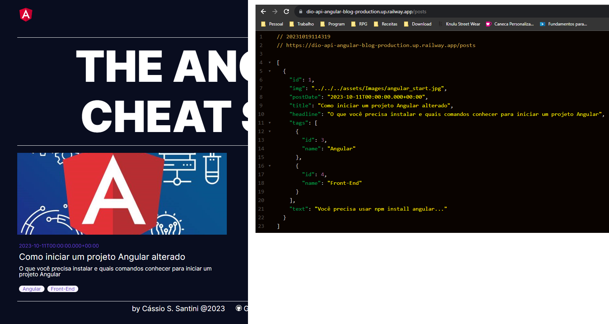

# Dio Lab - Blog com Angular
Lab Project da DIO para o Santander Bootcamp 2023 FullStack Java + Angular.


## Inspiração
Ironicamente, achei o mesmo exemplo de Blog que o expert Felipe usou na descrição do desafio, mas achei no Figma Community, um design de Faqih Sopyan.

## Objetivo
Meu objetivo inicial (ainda estou terminando as aulas de Angular) é construir um blog que me ajude a criar um "cheat-sheet", um resumo de informações úteis, sobre o Angular.

## Links
- [Folha de Estilos no Figma Community](https://www.figma.com/community/file/1235152009438565697)
- [Angular Docs](https://angular.io/docs)

## Para rodar o projeto
- Garanta que você tem o ```node``` e o ```git``` instalado em sua máquina;
- Faça o clone do projeto com ```git clone https://github.com/Enyus/dio-angular-blog.git```;
- Entre na pasta DIO_Angular_Blog com ```cd .\DIO_Angular_Blog\``` e instale as dependências com ```npm install```;
- Se não tiver o Angular CLI instalado na sua máquina, instale-o globalmente com o código ```npm install -g @angular/cli```
- Rode a aplicação com ```ng serve```. O app será executado na porta http://localhost:4200/.

## Para o Futuro
Como o bootcamp tem data para terminar, resolvi fazer apenas um esqueleto do blog, mas tenho a intenção de criar páginas ou dialogs para os posts para criar um meio facilitado (especialmente pra mim) de encontrar um resumo do que foi aprendido em relação ao Angular.

## Consumindo uma API com Angular
Tive uma dificuldade inicial para consumir a [API criada em outro desafio do bootcamp](https://github.com/Enyus/dio-api-angular-blog), até porque não lembro se o bootcamp envolveu essa funcionalidade do Angular. Então, encontrei [este vídeo](https://www.youtube.com/watch?v=6QXBTeVf0VY) que ensina usar o ```HttpClient``` nativo do próprio Angular para o consumo de APIs.

### Criando uma service
É uma boa prática separar qualquer código que não se refira ao comportamento e design de um componente em uma service. O Angular CLI permite a criação da service com o comando ```ng g s <nome do arquivo>```.

---

Para injetar a service no componente, deve-se criar um construtor para o componente com um parâmetro do tipo do service a ser injetado:
```ts
import { PostService } from './service/post.service';

// demais códigos do Componente

export class AppComponent {
  constructor(private postService:PostService) {}
}
```

---

Para usar o HttpClient na service, ele deve ser importado e declarado no construtor da mesma:
```ts
import { HttpClient } from '@angular/common/http'

// demais códigos da Service

export class PostService {
  constructor(private httpClient:HttpClient) { }
}
```

---

Também, deve-se incluir a importação do módulo HttpClient em ```app.module.ts```, para deixá-lo disponível à aplicação:
```ts
// app.module.ts:
import { HttpClientModule } from '@angular/common/http';
// demais importações
@NgModule({
  declarations: [
    //declarações
  ],
  imports: [
    //demais importações de módulos
    HttpClientModule
  ],
  providers: [],
  bootstrap: [AppComponent]
})
export class AppModule {}
```

---

O HttpClient tem diversos métodos que representam os métodos HTTP mais comuns, como ```GET```, ```POST```, ```PUT``` e ```DELETE```:


Assim, como no caso, eu gostaria de invocar a API para pegar os posts do blog, criei o método ```obterTodos``` em ```post.service.ts```:
```ts
export class PostService {

  constructor(private httpClient:HttpClient) {}

  obterTodos(){
    return this.httpClient.get(`${API_URL}/posts`)
  }
}
```

---

O método ```.get``` do HttpClient exige que a url do endpoint a ser consultado seja passado como parâmetro. Como boa prática, não é recomendado passar a url de uma API diretamente no código. Ao invés disso, é melhor passá-la como uma variável de ambiente. No vídeo, a criação do projeto Angular (não sei qual versão estava usando) já criava um arquivo ```environment.ts```, o que não aconteceu no meu caso (Angular 16). Assim, [depois de ler este artigo](https://zeroesandones.medium.com/how-to-use-environment-variable-in-angular-16-29b5cbb6bd85) descobri que é possível criar tal arquivo pelo CLI através do comando ```ng g environments```. É notável, ainda, que a variável de ambiente deverá ser importada no serviço:
```ts
// post.service.ts
import { API_URL } from 'src/environments/environment';
// demais códigos
```

---

Todos os métodos do HttpClient retornam um ```Observable```, que é algo que ainda não estudei e, prevendo isso até, o vídeo menciona que o retorno deve ocorrer pelo método adicional ```.toPromise()```, para retornar uma Promise comum. No entanto ```.toPromise()``` foi depreciado e, depois de ler [este artigo](https://stackoverflow.com/questions/67044273/rxjs-topromise-deprecated), descobri que o novo modo de fazer é usando a função ```firstValueFrom```, a ser importado de ```rxjs```:
```ts
// post.service.ts
import { firstValueFrom } from 'rxjs';
// demais códigos
obterTodos(){
    return firstValueFrom(this.httpClient.get(`${API_URL}/posts`));
}
```

---

No entanto, a promise retornada seria do tipo ```Promise<Object>```, que é o padrão e contraprodutivo no uso do Typescript, assim, é possível determinar qual o tipo de objeto que será retornado ao declarar o método ```.get``` com o descritor ```.get<Post[]>```, uma vez que se espera que a API retorne um array de objetos do tipo Post (*já modelado em ```/model/Post.ts```*):
```ts
// post.service.ts
import { firstValueFrom } from 'rxjs';
// demais códigos
obterTodos(){
    return firstValueFrom(this.httpClient.get<Post[]>(`${API_URL}/posts`));
}
```

---

Agora, no componente, deve ser criado um método que acionará a API através do serviço:
```ts
// app.component.ts
// importações
export class AppComponent {
    // demais códigos do componente
    obterPosts(){
        this.postService.obterTodos()
            .then(res => this.posts = res)
            .catch(console.error);
    }
}
```

---
Como, no meu caso, quero que a API seja consultada assim que a aplicação abrir, simplesmente chamei a função ```obterPosts``` dentro do construtor de ```app.component.ts```:
```ts
// app.component.ts
// importações
export class AppComponent {
    // demais códigos do componente
    constructor(private postService:PostService) {
        this.obterPosts();
    }

    obterPosts(){
        this.postService.obterTodos()
            .then(res => this.posts = res)
            .catch(console.error);
    }
}
```

---

E funcionou:



## Pontos interessantes
- Num arquivo de estilo de um componente Angular, se pode usar o seletor CSS ```:host``` que selecionará o componente como um todo, se tornando desnecessário criar uma div pai para o componente.